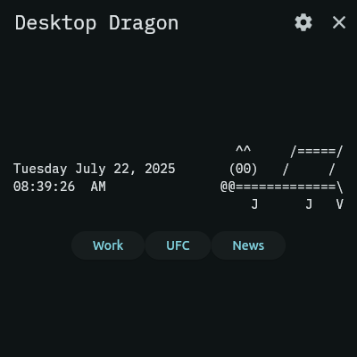

# desktop dragon

A dragon for your desktop.

This is a flutter app. It should be able to be run on Windows MacOS and Linux just open the directory in terminal and write 'flutter run'

Alongside the dragon you have 3 configurible buttons that you can map to open your favorite websites.

I.E. you can map one button to have all your websites you have to open to do work. (Your work email, your slack, etc.)

This app was made for the 2025 Ubuntu flutter community desktop jam!

By ShadowOfHassen

## Screenshot

This is licensed under the GNU GPL 3.0 License

Please Give it a star if you like it, and open issues for any suggestions.